### Week 1

Generative AI Foundational Models: GPT, LLaMa, BERT, PaLM, BLOOM, FLAN-T5.

The more parameters, the more memory and language understanding and the more sophisticated tasks it can perform.

Prompt -> Model Inference -> Completion

**Next word prediction** can be used for summarization, translation, coding, information retrieval, named entity recognition...

Previous generation models used Recurrent Neural Networks (RNNs). RNNs while powerful for their time, were limited by the amount of compute and memory needed to perform well at generative tasks.

**Transformer architecture** started with paper "Attention is all you need", in 2017. This novel approach unlocked the progress in generative AI that we see today. It can be scaled efficiently to use multi-core GPUs, it can parallel process input data, making use of much larger training datasets, and crucially, it's able to learn to pay attention to the meaning of the words it's processing.

### Transformers

The power of the transformer architecture lies in its ability to learn the relevance and context of all of the words in a sentence. Not just to each word next to its neighbor, but to every other word in a sentence. To apply attention weights to those relationships so that the model learns the relevance of each word to each other words no matter where they are in the input. 

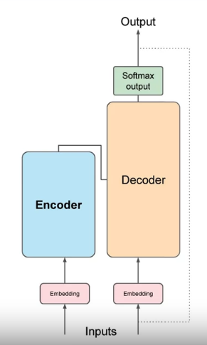

Words are tokenized before fed to the model. A token can be the whole word or part of the word. You then have to use the same tokenizer to train and predict. The token is then embedded, mapped to a multidimensional vector, that encodes the meaning and context of each token. Positional embeddings are also added to preserve the ordering of words in the input sentence.

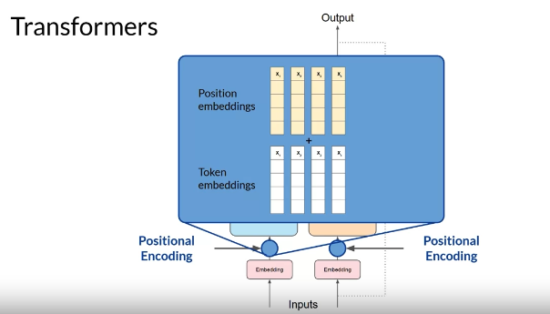

The embeddings are passed into the self-attention layers, which learn the importance of every word to every other word in the input sequence. It has **Multi-headed self-attention**. This means that multiple sets of self-attention weights or heads are learned in parallel independently of each other. The number of attention heads included in the attention layer varies from model to model, but numbers in the range of 12-100 are common. The intuition here is that each self-attention head will learn a different aspect of language. For example, one head may see the relationship between the people entities in our sentence. Whilst another head may focus on the activity of the sentence. Whilst yet another head may focus on some other properties such as if the words rhyme.

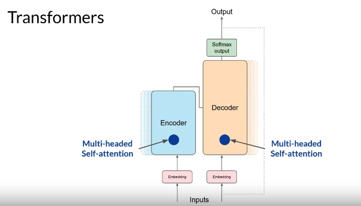

The output is then processed through a fully-connected feed-forward network. The output of this layer is a vector of logits proportional to the probability score for each and every token in the tokenizer dictionary. You can then pass these logits to a final softmax layer, where they are normalized into a probability score for each word.
One single token will have a score higher than the rest. This is the most likely predicted token.

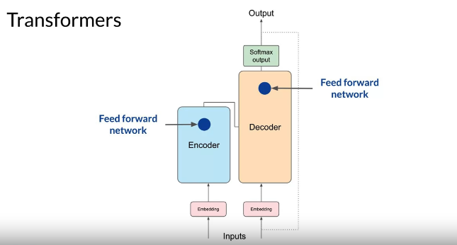

Example: translation

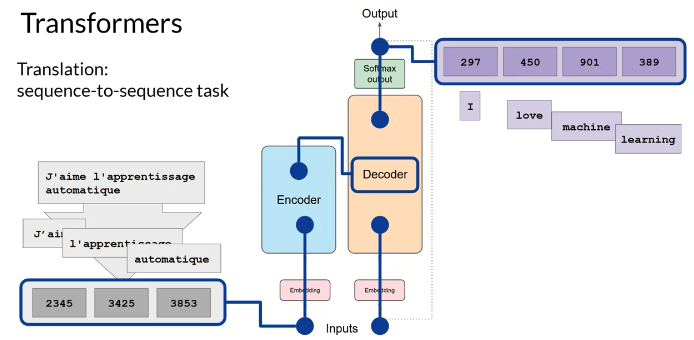

Encoder: encodes inputs ("prompts") with contextual understanding and produces one vector per input token.

Decoder: Accepts input tokens and generates new tokens.

There are encoder only models, encoder decoders models and decoder only models. 

**Prompt engineering**

- **In-context learning** - Include examples in the context window. Zero / one / few shot inference. If more than 5-6 examples don't increase performance, fine-tuning should be preferred. 

The larger the model, the more performant it is at zero shot inference. Smaller models are generally good at a few tasks, similar to the ones they were trained on.

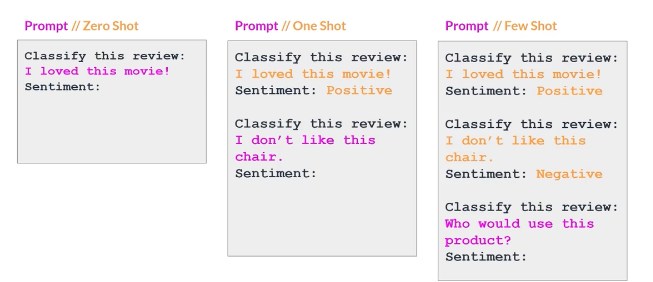

Inference configuration parameters - temperature, max new tokens, topK, topP.

Greedy vs random sampling - greedy will always choose the word with the highest probability but words can be repeated and the answer gets less natural and less reasonable. Random sampling will select based on random-weighted strategy across all probabilities.

topK selects an output using the top-K results after applying random-weighted strategy using the probabilities. 

topP selects using the random-weighted strategy with the top-ranked consecutive results by probability and with a cumulative probability <= p.

Temperature influences the shape of the probability distribution. The higher the temperature, the higher the randomness.

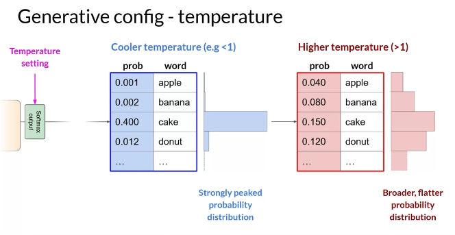
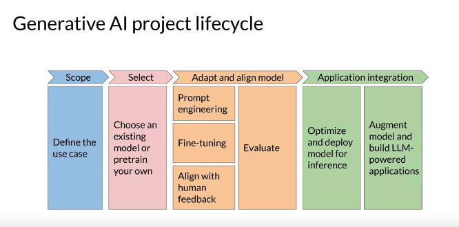

LLM pre-training: learning from large amounts of unstructured textual data, learning patterns and structures in the language. Involves a lot of compute and GPUs. Often needed are data filtering, to improve quality, reduce bias and remove harmful content. Only 1-3% of the original tokens are kept for training!

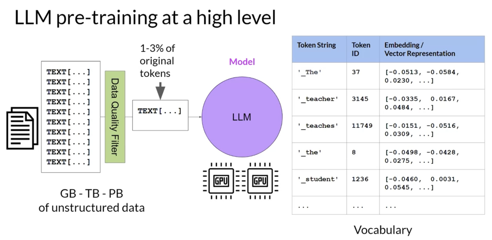

Encoder only models are trained on masked language modeling tasks, where some tokens are masked and the model has to predict them. These models build bidirectional representations of the input sequence, understanding the full context of each token in the sequence. They are good for tasks that benefit from understanding the full context of the input: sentiment analysis, named entity recognition, word classification. e.g. BERT, ROBERTA.

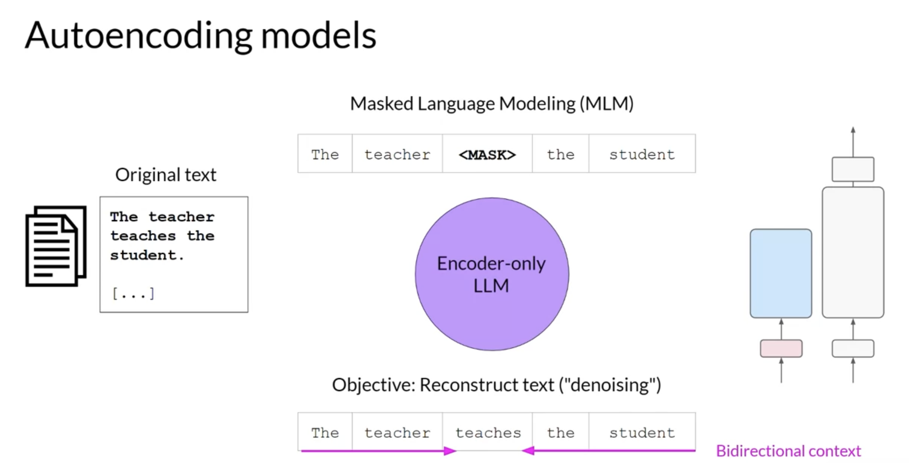

Decoder only models are trained on causal language modeling tasks, where the model has to predict the next token in the sequence. The context used is unidirectional. These models are good for tasks like text generation. e.g. GPT, BLOOM.

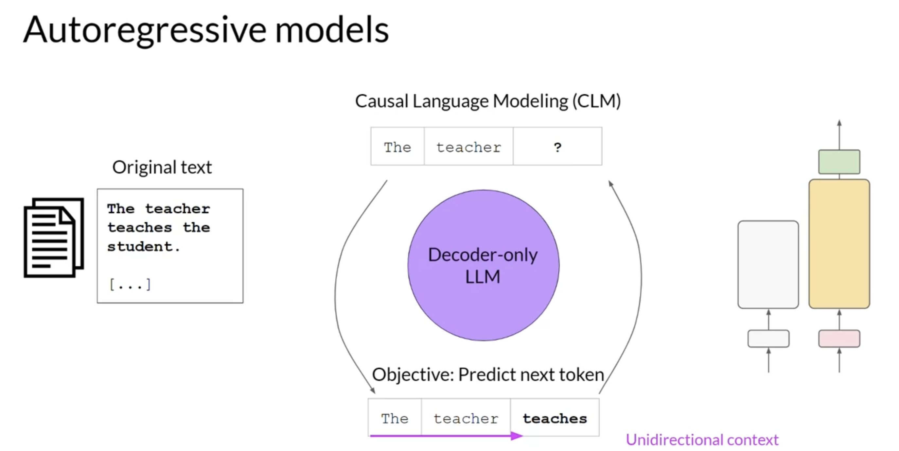

Encoder-decoder models are trained based on span corruption tasks. These models are good for translation, summarization, question answering. e.g. BART, T5.

Computational challenges: CUDA runs out of memory. e.g. 24GB of GPU RAM to train a 1B parameter model @ 32-bit precision. This is to store the model weights, activations, gradients, optimizer states, etc.

To address this, 16-bit precision can be used (quantization), which lowers precision but is acceptable for most cases.

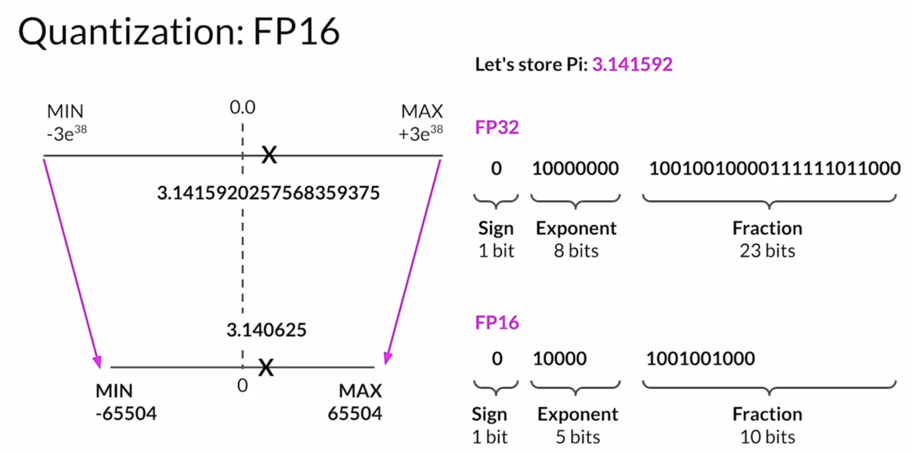

BFLOAT16 is another option, used for newer deep learning models.

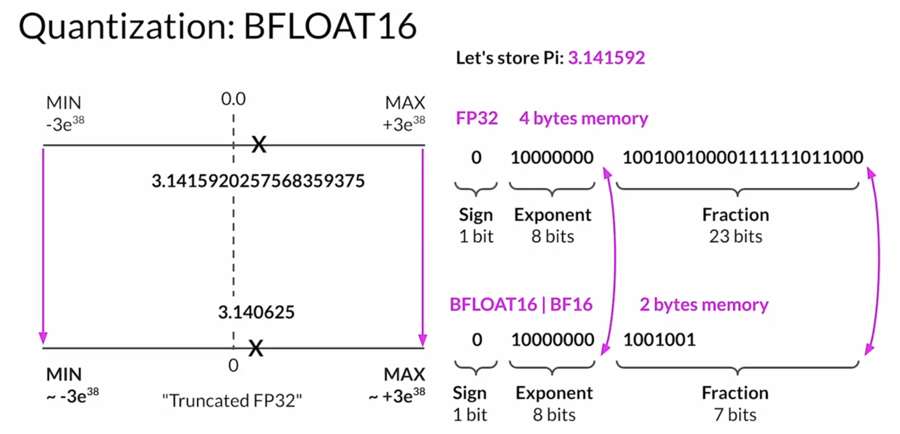

Quantization aware training learns the quantization scaling factors during training.

As models scale, multiple GPUs are needed. 
