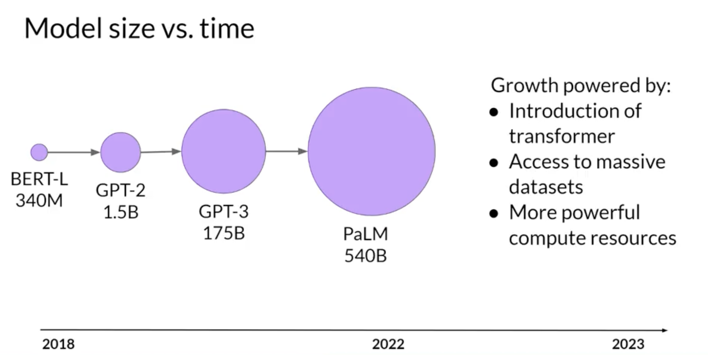

### Week 1

Generative AI Foundational Models: GPT, LLaMa, BERT, PaLM, BLOOM, FLAN-T5.

The more parameters, the more memory and language understanding and the more sophisticated tasks it can perform.

Prompt (Context Window) -> Inference -> Completion

**Next word prediction** can be used for summarization, translation, coding, information retrieval, named entity recognition...

You don't always need a large model, smaller models can be fine-tuned to specific focused tasks. 

Previous generation models used Recurrent Neural Networks (RNNs). RNNs while powerful for their time, were limited by the amount of compute and memory needed to perform well at generative tasks.

**Transformer architecture** started with paper "Attention is all you need", in 2017. This novel approach unlocked the progress in generative AI that we see today. It can be scaled efficiently to use multi-core GPUs, it can parallel process input data, making use of much larger training datasets, and crucially, it's able to learn to pay attention to the meaning of the words it's processing.

### Transformers

The power of the transformer architecture lies in its ability to learn the relevance and context of all of the words in a sentence. Not just to each word next to its neighbor, but to every other word in a sentence. To apply attention weights to those relationships so that the model learns the relevance of each word to each other words no matter where they are in the input. 

Words are tokenized before fed to the model since a Machine Learning model works with numbers and not words. A token can represent the whole word or a part of the word. You then have to use the same tokenizer to train and predict/generate. The token is then embedded, mapped to a multidimensional vector, that encodes the meaning and context of individual tokens in the input sequence. Positional embeddings are also added to preserve the ordering of words in the input sentence.

The embeddings are passed into the self-attention layers, which learn the importance of every word to every other word in the input sequence. It has **Multi-headed self-attention**. This means that multiple sets of self-attention weights or heads are learned in parallel independently of each other. The number of attention heads included in the attention layer varies from model to model, but numbers in the range of 12-100 are common. The intuition here is that each self-attention head will learn a different aspect of language. For example, one head may see the relationship between the people entities in our sentence. Whilst another head may focus on the activity of the sentence. Whilst yet another head may focus on some other properties such as if the words rhyme. We don't dictate ahead of time which aspect of language each head will learn, the weights of each head are randomly initialized.

The output is then processed through a fully-connected feed-forward network. The output of this layer is a vector of logits proportional to the probability score for each and every token in the tokenizer dictionary. You can then pass these logits to a final softmax layer, where they are normalized into a probability score for each word.
One single token will have a score higher than the rest. This is the most likely predicted token.

Example: translation

Encoder: encodes inputs ("prompts") with contextual understanding and produces one vector per input token.

Decoder: Accepts input tokens and generates new tokens.

There are encoder only models, encoder decoders models and decoder only models. Decoder only models are the most popular today.

**"Attention is All You Need"**

"Attention is All You Need" is a research paper published in 2017 by Google researchers, which introduced the Transformer model, a novel architecture that revolutionized the field of natural language processing (NLP) and became the basis for the LLMs we  now know - such as GPT, PaLM and others. The paper proposes a neural network architecture that replaces traditional recurrent neural networks (RNNs) and convolutional neural networks (CNNs) with an entirely attention-based mechanism. 

The Transformer model uses self-attention to compute representations of input sequences, which allows it to capture long-term dependencies and parallelize computation effectively. The authors demonstrate that their model achieves state-of-the-art performance on several machine translation tasks and outperforms previous models that rely on RNNs or CNNs.

The Transformer architecture consists of an encoder and a decoder, each of which is composed of several layers. Each layer consists of two sub-layers: a multi-head self-attention mechanism and a feed-forward neural network. The multi-head self-attention mechanism allows the model to attend to different parts of the input sequence, while the feed-forward network applies a point-wise fully connected layer to each position separately and identically. 

The Transformer model also uses residual connections and layer normalization to facilitate training and prevent overfitting. In addition, the authors introduce a positional encoding scheme that encodes the position of each token in the input sequence, enabling the model to capture the order of the sequence without the need for recurrent or convolutional operations.

**Prompt engineering**

- **In-context learning** - Include examples in the context window to help the model learn the task. Zero / one / few shot inference. If more than 5-6 examples don't increase performance, fine-tuning should be preferred. 

The larger the model, the more performant it is at zero shot inference. Smaller models are generally good at a few tasks, similar to the ones they were trained on.

Inference configuration parameters - temperature, max new tokens, topK, topP.

Greedy vs random sampling - greedy will always choose the word with the highest probability but words can be repeated and the answer gets less natural and less reasonable so this method is good for short generation. Random sampling will select based on random-weighted strategy across all probabilities so this generates more natural and creative text.

topK selects an output using the top-K results after applying random-weighted strategy using the probabilities. 

topP selects using the random-weighted strategy with the top-ranked consecutive results by probability and with a cumulative probability <= p.

Temperature influences the shape of the probability distribution. The higher the temperature, the higher the randomness. The temperature actually alters the predictions the model will make, unlike topK or topP.

LLM pre-training: learning from large amounts of unstructured textual data, learning patterns and structures in the language. Involves a lot of compute and GPUs. Often needed are data filtering, to improve quality, reduce bias and remove harmful content. Only 1-3% of the original tokens are kept for training!

Encoder only models are trained on masked language modeling tasks, where some randomly chosen tokens are masked and the model has to predict them. These models build bidirectional representations of the input sequence, understanding the full context of each token in the sequence. They are good for tasks that benefit from understanding the full context of the input (bidirectional context): sentiment analysis, named entity recognition, word classification. e.g. BERT, ROBERTA.

Decoder only models are trained on causal language modeling tasks, where the model has to predict the next token in the sequence. The context used is unidirectional, only previous tokens are seen by the model during training. These models are good for tasks like text generation. e.g. GPT, BLOOM.

The exact details of the pre-training objective of Encoder-decoder models vary from model to model. A popular sequence-to-sequence model T5, pre-trains based on span corruption tasks. These models are good for translation, summarization, question answering. e.g. BART, T5.

In general, the more parameters, the more capable a model is at any given task. It may be infeasible to just keep increasing and training larger and larger models, given the cost, though.

Computational challenges: CUDA runs out of memory. e.g. 24GB of GPU RAM to train a 1B parameter model @ 32-bit precision. This is to store the model weights, activations, gradients, optimizer states, etc.

To address this, 16-bit precision can be used (quantization), which lowers precision but is acceptable for most cases.

BFLOAT16 is another option, used for newer deep learning models, like flan-T5. It significantly helps with pre-training stability. It's known as truncated 32-bit float. Not well suited for integer calculations but these are relatively rare in deep learning calculations.

INT8 will incur a huge precision loss. 

Quantization aware training learns the quantization scaling factors during training.

As models scale, multiple GPUs for training are needed. 

Data parallelism is a strategy that splits the training data across multiple GPUs. Each GPU processes a different subset of the data simultaneously, which can greatly speed up the overall training time.

Distribute Data Parallel from pytorch - Distribute datasets across GPUs which train a copy of the model, and then synchronization step combines the results. Requires that the model fits in a single GPU.

Fully sharded data parallel - Zero redundancy optimizer distributes models across GPUs. This is suitable for models that cannot fit in a single GPU.

Researchers have explored the trade-offs between training dataset size, model size and compute budget. 

1 petaflop/s-day is approximately equivalent to 8 NVIDIA V100 chips operating at full efficiency for one day, in the context of training transformers. This is equivalent to 2 NVIDIA A100 GPUs. Huge amounts of compute are required to train the bigger models...

Chinchilla paper suggests that some large models may be over parametrized and under trained. So smaller models are starting to come up, trained more optimally.

Pre-training for domain adaptation - when very specific language are common but unlikely to have come up extensively in the training dataset. e.g. BloombergGPT

BloombergGPT, developed by Bloomberg, is a large Decoder-only language model. It underwent pre-training using an extensive financial dataset comprising news articles, reports, and market data, to increase its understanding of finance and enabling it to generate finance-related natural language text. The datasets are shown in the image above.

During the training of BloombergGPT, the authors used the Chinchilla Scaling Laws to guide the number of parameters in the model and the volume of training data, measured in tokens. The recommendations of Chinchilla are represented by the lines Chinchilla-1, Chinchilla-2 and Chinchilla-3 in the image, and we can see that BloombergGPT is close to it. 

While the recommended configuration for the team’s available training compute budget was 50 billion parameters and 1.4 trillion tokens, acquiring 1.4 trillion tokens of training data in the finance domain proved challenging. Consequently, they constructed a dataset containing just 700 billion tokens, less than the compute-optimal value. Furthermore, due to early stopping, the training process terminated after processing 569 billion tokens.

The BloombergGPT project is a good illustration of pre-training a model for increased domain-specificity, and the challenges that may force trade-offs against compute-optimal model and training configurations.

In contrast to pre-training, where you train the LLM using vast amounts of unstructured textual data via self-supervised learning, fine-tuning is a supervised learning process where you use a data set of labeled examples to update the weights of the LLM. The labeled examples are prompt completion pairs, the fine-tuning process extends the training of the model to improve its ability to generate good completions for a specific task.

**Instruction fine-tuning** trains the model using examples that demonstrate how it should respond to a specific instruction.

You can fine-tune a pre-trained model to improve performance on only the task that is of interest to you. For example, summarization using a dataset of examples for that task. Interestingly, good results can be achieved with relatively few examples. Often just 500-1,000 examples can result in good performance in contrast to the billions of pieces of texts that the model saw during pre-training. However, there is a potential downside to fine-tuning on a single task. The process may lead to a phenomenon called **catastrophic forgetting**. Catastrophic forgetting happens because the full fine-tuning process modifies the weights of the original LLM. While this leads to great performance on the single fine-tuning task, it can degrade performance on other tasks. If you do want or need the model to maintain its multitask generalized capabilities, you can perform fine-tuning on multiple tasks at one time. Good multitask fine-tuning may require 50-100,000 examples across many tasks, and so will require more data and compute to train. Our second option is to perform parameter efficient fine-tuning, or PEFT for short instead of full fine-tuning. PEFT is a set of techniques that preserves the weights of the original LLM and trains only a small number of task-specific adapter layers and parameters. PEFT shows greater robustness to catastrophic forgetting since most of the pre-trained weights are left unchanged.

One way to mitigate catastrophic forgetting is by using regularization techniques to limit the amount of change that can be made to the weights of the model during training. This can help to preserve the information learned during earlier training phases and prevent overfitting to the new data.

FLAN, which stands for fine-tuned language net, is a specific set of instructions used to fine-tune different models. FLAN-T5, the FLAN instruct version of the T5 foundation model. FLAN-T5 is a great general purpose instruct model. In total, it's been fine tuned on 473 datasets across 146 task categories. 

We can also further fine tine the FLAN-T5 model based on custom data, e.g. dialogue conversations which we would like it to summarize later.

### LLM Evaluation Metrics

Accuracy = Correct predictions / total predictions

Accuracy is not viable since LLMs are not deterministic in their outputs.

ROUGE-1 doesn't consider ordering of the words. Also, "it is very cold outside" and "it is not cold outside" would get the same score...

ROUGE-2 aknowledge the ordering of words by taking pairs of words at a time. 

ROUGE scores for different tasks are not comparable to one another. 

Use rouge for diagnostic evaluation of summarization tasks and BLEU for translation tasks. For overall evaluation of your model's performance, however, you will need to look at one of the evaluation benchmarks that have been developed by researchers.

You'll get a more accurate and useful sense of the model's capabilities by evaluating its performance on data that it hasn't seen before. Benchmarks, such as **GLUE**, **SuperGLUE**, or **Helm**, cover a wide range of tasks and scenarios. They do this by designing or collecting datasets that test specific aspects of an LLM. 

**GLUE**, or General Language Understanding Evaluation, was introduced in 2018. GLUE is a collection of natural language tasks, such as sentiment analysis and question-answering. GLUE was created to encourage the development of models that can generalize across multiple tasks, and you can use the benchmark to measure and compare the model performance. 

As a successor to GLUE, **SuperGLUE** was introduced in 2019, to address limitations in its predecessor. It consists of a series of tasks, some of which are not included in GLUE, and some of which are more challenging versions of the same tasks. SuperGLUE includes tasks such as multi-sentence reasoning, and reading comprehension. Both the GLUE and SuperGLUE benchmarks have leaderboards that can be used to compare and contrast evaluated models. As models get larger, their performance against benchmarks such as SuperGLUE start to match human ability on specific tasks.

Here are a couple of recent benchmarks that are pushing LLMs further. **Massive Multitask Language Understanding**, or MMLU, is designed specifically for modern LLMs. To perform well models must possess extensive world knowledge and problem-solving ability. Models are tested on elementary mathematics, US history, computer science, law, and more. In other words, tasks that extend way beyond basic language understanding.

**BIG-bench** currently consists of 204 tasks, ranging through linguistics, childhood development, math, common sense reasoning, biology, physics, social bias, software development and more. BIG-bench comes in three different sizes, and part of the reason for this is to keep costs achievable, as running these large benchmarks can incur large inference costs. 

A final benchmark you should know about is the **Holistic Evaluation of Language Models**, or HELM. The HELM framework aims to improve the transparency of models, and to offer guidance on which models perform well for specific tasks. HELM takes a multimetric approach, measuring seven metrics across 16 core scenarios, ensuring that trade-offs between models and metrics are clearly exposed.

### Parameter-efficient fine-tuning (PEFT)

**Full fine-tuning** requires memory not just to store the model, but various other parameters that are required during the training process. Even if your computer can hold the model weights, which are now on the order of hundreds of gigabytes for the largest models, you must also be able to allocate memory for optimizer states, gradients, forward activations, and temporary memory throughout the training process. These additional components can be many times larger than the model and can quickly become too large to handle on consumer hardware.

In contrast to full fine-tuning where every model weight is updated during supervised learning, parameter efficient fine tuning methods only update a small subset of parameters. 

Some PEFT techniques freeze most of the model weights and focus on fine tuning a subset of existing model parameters, for example, particular layers or components. Other techniques don't touch the original model weights at all, and instead add a small number of new parameters or layers and fine-tune only the new components.

With PEFT, most if not all of the LLM weights are kept frozen. As a result, the number of trained parameters is much smaller than the number of parameters in the original LLM. In some cases, just 15-20% of the original LLM weights.

In fact, PEFT can often be performed on a single GPU. And because the original LLM is only slightly modified or left unchanged, PEFT is less prone to the catastrophic forgetting problems of full fine-tuning.

With parameter efficient fine-tuning, you train only a small number of weights, which results in a much smaller footprint overall, as small as megabytes depending on the task. The new parameters are combined with the original LLM weights for inference. The PEFT weights are trained for each task and can be easily swapped out for inference, allowing efficient adaptation of the original model to multiple tasks.

There are several methods you can use for parameter efficient fine-tuning, each with trade-offs on parameter efficiency, memory efficiency, training speed, model quality, and inference costs. Let's take a look at the three main classes of PEFT methods. 

**Selective methods** are those that fine-tune only a subset of the original LLM parameters. There are several approaches that you can take to identify which parameters you want to update. You have the option to train only certain components of the model or specific layers, or even individual parameter types. Researchers have found that the performance of these methods is mixed and there are significant trade-offs between parameter efficiency and compute efficiency. 

**Reparameterization methods** also work with the original LLM parameters, but reduce the number of parameters to train by creating new low rank transformations of the original network weights. A commonly used technique of this type is **LoRA**.

Lastly, **additive methods** carry out fine-tuning by keeping all of the original LLM weights frozen and introducing new trainable components. Here there are two main approaches. Adapter methods add new trainable layers to the architecture of the model, typically inside the encoder or decoder components after the attention or feed-forward layers. Soft prompt methods, on the other hand, keep the model architecture fixed and frozen, and focus on manipulating the input to achieve better performance. This can be done by adding trainable parameters to the prompt embeddings or keeping the input fixed and retraining the embedding weights.

Low-rank Adaptation, or LoRA for short, is a parameter-efficient fine-tuning technique that falls into the re-parameterization category. In the transformer architecture, the input prompt is turned into tokens, which are then converted to embedding vectors and passed into the encoder and/or decoder parts of the transformer. In both of these components, there are two kinds of neural networks; self-attention and feedforward networks. The weights of these networks are learned during pre-training. After the embedding vectors are created, they're fed into the self-attention layers where a series of weights are applied to calculate the attention scores. During full fine-tuning, every parameter in these layers is updated. 

LoRA is a strategy that reduces the number of parameters to be trained during fine-tuning by freezing all of the original model parameters and then injecting a pair of rank decomposition matrices alongside the original weights. The dimensions of the smaller matrices are set so that their product is a matrix with the same dimensions as the weights they're modifying. You then keep the original weights of the LLM frozen and train the smaller matrices using the same supervised learning process you saw earlier this week. For inference, the two low-rank matrices are multiplied together to create a matrix with the same dimensions as the frozen weights. You then add this to the original weights and replace them in the model with these updated values. 

Because this model has the same number of parameters as the original, there is little to no impact on inference latency.

Researchers have found that applying LoRA to just the self-attention layers of the model is often enough to fine-tune for a task and achieve performance gains. However, in principle, you can also use LoRA on other components like the feed-forward layers.

Let's look at a practical example using the transformer architecture described in the Attention is All You Need paper. The paper specifies that the transformer weights have dimensions of 512 by 64. This means that each weights matrix has 32,768 trainable parameters. If you use LoRA as a fine-tuning method with the rank equal to eight, you will instead train two small rank decomposition matrices whose small dimension is eight. This means that Matrix A will have dimensions of 8 by 64, resulting in 512 total parameters. Matrix B will have dimensions of 512 by 8, or 4,096 trainable parameters. By updating the weights of these new low-rank matrices instead of the original weights, you'll be training 4,608 parameters instead of 32,768 and 86% reduction.

Because LoRA allows you to significantly reduce the number of trainable parameters, you can often perform this method of parameter efficient fine tuning with a single GPU and avoid the need for a distributed cluster of GPUs.

Since the rank-decomposition matrices are small, you can fine-tune a different set for each task and then switch them out at inference time by updating the weights. Suppose you train a pair of LoRA matrices for a specific task; let's call it Task A. To carry out inference on this task, you would multiply these matrices together and then add the resulting matrix to the original frozen weights. You then take this new summed weights matrix and replace the original weights where they appear in your model. You can then use this model to carry out inference on Task A. If instead, you want to carry out a different task, say Task B, you simply take the LoRA matrices you trained for this task, calculate their product, and then add this matrix to the original weights and update the model again. The memory required to store these LoRA matrices is very small. So in principle, you can use LoRA to train for many tasks. Switch out the weights when you need to use them, and avoid having to store multiple full-size versions of the LLM.

The takeaway here is that ranks in the range of 4-32 can provide you with a good trade-off between reducing trainable parameters and preserving performance. Optimizing the choice of rank is an ongoing area of research and best practices may evolve as more practitioners like you make use of LoRA.

### Prompt tuning

With prompt tuning, you add additional trainable tokens to your prompt and leave it up to the supervised learning process to determine their optimal values. The set of trainable tokens is called a **soft prompt**, and it gets prepended to embedding vectors that represent your input text. The soft prompt vectors have the same length as the embedding vectors of the language tokens. And including somewhere between 20 and 100 virtual tokens can be sufficient for good performance. 

The tokens that represent natural language are hard in the sense that they each correspond to a fixed location in the embedding vector space. However, the soft prompts are not fixed discrete words of natural language. Instead, you can think of them as virtual tokens that can take on any value within the continuous multidimensional embedding space. And through supervised learning, the model learns the values for these virtual tokens that maximize performance for a given task. 

The weights of the large language model are frozen and the underlying model does not get updated. Instead, the embedding vectors of the soft prompt gets updated over time to optimize the model's completion of the prompt.

Similar to what you saw with LoRA, you can train a different set of soft prompts for each task and then easily swap them out at inference time. You can train a set of soft prompts for one task and a different set for another. To use them for inference, you prepend your input prompt with the learned tokens to switch to another task, you simply change the soft prompt. Soft prompts are very small on disk, so this kind of fine tuning is extremely efficient and flexible.

Prompt tuning doesn't perform as well as full fine tuning for smaller LLMs. However, as the model size increases, so does the performance of prompt tuning. And once models have around 10 billion parameters, prompt tuning can be as effective as full fine tuning and offers a significant boost in performance over prompt engineering alone

One potential issue to consider is the interpretability of learned virtual tokens. Remember, because the soft prompt tokens can take any value within the continuous embedding vector space. The trained tokens don't correspond to any known token, word, or phrase in the vocabulary of the LLM. However, an analysis of the nearest neighbor tokens to the soft prompt location shows that they form tight semantic clusters.

## Reinforcement Learning From Human Feedback (RLHF)

By aligning the model with human feedback and using reinforcement learning as an algorithm, you can help to align the model to reduce harmful or toxic content and to align towards, less harmful and much more helpful content as well. 

HHH - helpful, honest, harmless principles

Reinforcement learning is a type of machine learning in which an agent learns to make decisions related to a specific goal by taking actions in an environment, with the objective of maximizing some notion of a cumulative reward.

In this framework, the agent continually learns from its experiences by taking actions, observing the resulting changes in the environment, and receiving rewards or penalties, based on the outcomes of its actions. By iterating through this process, the agent gradually refines its strategy or policy to make better decisions and increase its chances of success.

In our case, the agent's policy that guides the actions is the LLM, and its objective is to generate text that is perceived as being aligned with the human preferences. This could mean that the text is, for example, helpful, accurate, and non-toxic. The environment is the context window of the model, the space in which text can be entered via a prompt. The state that the model considers before taking an action is the current context. That means any text currently contained in the context window. The action here is the act of generating text. This could be a single word, a sentence, or a longer form text, depending on the task specified by the user. The action space is the token vocabulary, meaning all the possible tokens that the model can choose from to generate the completion. 

At any given moment, the action that the model will take, meaning which token it will choose next, depends on the prompt text in the context and the probability distribution over the vocabulary space. The reward is assigned based on how closely the completions align with human preferences. 

Given the variation in human responses to language, determining the reward is more complicated than in the Tic-Tac-Toe example. One way you can do this is to have a human evaluate all of the completions of the model against some alignment metric, such as determining whether the generated text is toxic or non-toxic. This feedback can be represented as a scalar value, either a zero or a one. The LLM weights are then updated iteratively to maximize the reward obtained from the human classifier, enabling the model to generate non-toxic completions. 

However, obtaining human feedback can be time consuming and expensive. As a practical and scalable alternative, you can use an additional model, known as the reward model, to classify the outputs of the LLM and evaluate the degree of alignment with human preferences. You'll start with a smaller number of human examples to train the secondary model by your traditional supervised learning methods. Once trained, you'll use the reward model to assess the output of the LLM and assign a reward value, which in turn gets used to update the weights off the LLM and train a new human aligned version. Exactly how the weights get updated as the model completions are assessed, depends on the algorithm used to optimize the policy. 

The reward model is the central component of the reinforcement learning process. It encodes all of the preferences that have been learned from human feedback, and it plays a central role in how the model updates its weights over many iterations.

Human feedback process gets repeated for many prompt completion sets, building up a data set that can be used to train the reward model that will ultimately carry out this work instead of the humans. The same prompt completion sets are usually assigned to multiple human labelers to establish consensus and minimize the impact of poor labelers in the group. Labelers are often drawn from samples of the population that represent diverse and global thinking.

Before you start to train the reward model, however, you need to convert the ranking data into a pairwise comparison of completions. In other words, all possible pairs of completions from the available choices to a prompt should be classified as 0 or 1 score. In the example shown here, there are three completions to a prompt, and the ranking assigned by the human labelers was 2, 1, 3, as shown, where1 is the highest rank corresponding to the most preferred response. Depending on the number N of alternative completions per prompt, you will have N choose two combinations. For each pair, you will assign a reward of 1 for the preferred response and a reward of 0 for the less preferred response. Then you'll reorder the prompts so that the preferred option comes first. This is an important step because the reward model expects the preferred completion, which is referred to as Yj first. Once you have completed this data, restructuring, the human responses will be in the correct format for training the reward model. 

Note that while thumbs-up, thumbs-down feedback is often easier to gather than ranking feedback, ranked feedback gives you more prom completion data to train your reward model.

At this stage, you have everything you need to train the reward model. While it has taken a fair amount of human effort to get to this point, by the time you're done training the reward model, you won't need to include any more humans in the loop. Instead, the reward model will effectively take place off the human labeler and automatically choose the preferred completion during the HF process. This reward model is usually also a language model. For example, a BERT that is trained using supervised learning methods on the pairwise comparison data that you prepared from the human labelers assessment off the prompts. For a given prompt X, the reward model learns to favor the human-preferred completion yj, while minimizing the lock sigmoid off the reward difference, rj-rk.

Once the model has been trained on the human rank prompt-completion pairs, you can use the reward model as a binary classifier to provide a set of logits across the positive and negative classes. Logits are the unnormalized model outputs before applying any activation function. Let's say you want to detoxify your LLM, and the reward model needs to identify if the completion contains hate speech. In this case, the two classes would be not hate, the positive class that you ultimately want to optimize for and hate, the negative class you want to avoid. The largest value of the positive class is what you use as the reward value in LLHF. Just to remind you, if you apply a Softmax function to the logits, you will get the probabilities. The example here shows a good reward for non-toxic completion and the second example shows a bad reward being given for toxic completion.

### Proximal Policy Optimization (PPO)

PPO optimizes a policy, in this case the LLM, to be more aligned with human preferences. Over many iterations, PPO makes updates to the LLM. The updates are small and within a bounded region, resulting in an updated LLM that is close to the previous version, hence the name Proximal Policy Optimization.

You start PPO with your initial instruct LLM, then at a high level, each cycle of PPO goes over two phases. In Phase I, the LLM, is used to carry out a number of experiments, completing the given prompts. These experiments allow you to update the LLM against the reward model in Phase II. Remember that the reward model captures the human preferences. For example, the reward can define how helpful, harmless, and honest the responses are. The expected reward of a completion is an important quantity used in the PPO objective. We estimate this quantity through a separate head of the LLM called the value function. Let's have a closer look at the value function and the value loss. Assume a number of prompts are given. First, you generate the LLM responses to the prompts, then you calculate the reward for the prompt completions using the reward model. 

You have a set of prompt completions and their corresponding rewards. The value function estimates the expected total reward for a given State S.

The goal is to minimize the value loss that is the difference between the actual future total reward in this example, and its approximation to the value function. The value loss makes estimates for future rewards more accurate. The value function is then used in Advantage Estimation in Phase 2. 

In Phase 2, you make a small updates to the model and evaluate the impact of those updates on your alignment goal for the model. The model weights updates are guided by the prompt completion, losses, and rewards. PPO also ensures to keep the model updates within a certain small region called the trust region. This is where the proximal aspect of PPO comes into play. Ideally, this series of small updates will move the model towards higher rewards. The PPO policy objective is the main ingredient of this method. Remember, the objective is to find a policy whose expected reward is high. In other words, you're trying to make updates to the LLM weights that result in completions more aligned with human preferences and so receive a higher reward. The policy loss is the main objective that the PPO algorithm tries to optimize during training. 

First, focus on the most important expression and ignore the rest for now. Pi of A_t given S_t in this context of an LLM, is the probability of the next token A_t given the current prompt S_t. The action A_t is the next token, and the state S_t is the completed prompt up to the token t. The denominator is the probability of the next token with the initial version of the LLM which is frozen. The numerator is the probabilities of the next token, through the updated LLM, which we can change for the better reward. A-hat_t is called the estimated advantage term of a given choice of action. The advantage term estimates how much better or worse the current action is compared to all possible actions at that state. We look at the expected future rewards of a completion following the new token, and we estimate how advantageous this completion is compared to the rest.

Here is a visual representation of what I just described. You have a prompt S, and you have different paths to complete it, illustrated by different paths on the figure. The advantage term tells you how better or worse the current token A_t is with respect to all the possible tokens. 

A positive advantage means that the suggested token is better than the average. Therefore, increasing the probability of the current token seems like a good strategy that leads to higher rewards. This translates to maximizing the expression we have here. If the suggested token is worse than average, the advantage will be negative. Again, maximizing the expression will demote the token, which is the correct strategy. So the overall conclusion is that maximizing this expression results in a better aligned LLM. 

Directly maximizing the expression would lead into problems because our calculations are reliable under the assumption that our advantage estimations are valid. The advantage estimates are valid only when the old and new policies are close to each other. This is where the rest of the terms come into play. So stepping back and looking at the whole equation again, what happens here is that you pick the smaller of the two terms. The one we just discussed and this second modified version of it. Notice that this second expression defines a region, where two policies are near each other. These extra terms are guardrails, and simply define a region in proximity to the LLM, where our estimates have small errors. This is called the trust region. These extra terms ensure that we are unlikely to leave the trust region. In summary, optimizing the PPO policy objective results in a better LLM without overshooting to unreliable regions. 

You also have the entropy loss. While the policy loss moves the model towards alignment goal, entropy allows the model to maintain creativity. If you kept entropy low, you might end up always completing the prompt in the same way as shown here. Higher entropy guides the LLM towards more creativity. This is similar to the temperature setting. The difference is that the temperature influences model creativity at the inference time, while the entropy influences the model creativity during training. 

Putting all terms together as a weighted sum, we get our PPO objective, which updates the model towards human preference in a stable manner. This is the overall PPO objective. The C1 and C2 coefficients are hyperparameters. The PPO objective updates the model weights through back propagation over several steps. Once the model weights are updated, PPO starts a new cycle. For the next iteration, the LLM is replaced with the updated LLM, and a new PPO cycle starts. After many iterations, you arrive at the human-aligned LLM. 

Q-learning is an alternate technique for fine-tuning LLMs through RL, but PPO is currently the most popular method.

An interesting problem that can emerge in reinforcement learning is known as reward hacking, where the agent learns to cheat the system by favoring actions that maximize the reward received even if those actions don't align well with the original objective. As the policy tries to optimize the reward, it can diverge too much from the initial language model. For example, a model can start generating completions that it has learned will lead to very low toxicity scores by including phrases like most awesome, most incredible. The model could also start generating nonsensical, grammatically incorrect text that just happens to maximize the rewards in a similar way, outputs like this are definitely not very useful. 

To prevent our board hacking from happening, you can use the initial instruct LLM as performance reference. Let's call it the reference model. The weights of the reference model are frozen and are not updated during iterations of RHF. This way, you always maintain a single reference model to compare to. During training, each prompt is passed to both models, generating a completion by the reference LLM and the intermediate LLM updated model. At this point, you can compare the two completions and calculate a value called the Kullback-Leibler divergence, or KL divergence for short. 

KL divergence is a statistical measure of how different two probability distributions are. You can use it to compare the completions off the two models and determine how much the updated model has diverged from the reference. KL divergence is calculated for each generated token across the whole vocabulary off the LLM. This can easily be tens or hundreds of thousands of tokens. However, using a softmax function, you've reduced the number of probabilities to much less than the full vocabulary size. 

Once you've calculated the KL divergence between the two models, you add it as a term to the reward calculation. This will penalize the RL updated model if it shifts too far from the reference LLM and generates completions that are two different. Note that you now need two full copies of the LLM to calculate the KL divergence, the frozen reference LLM, and the RL updated PPO LLM. 

By the way, you can benefit from combining RLHF with PEFT. In this case, you only update the weights of a PEFT adapter, not the full weights of the LLM. This means that you can reuse the same underlying LLM for both the reference model and the PPO model, which you update with a trained PEFT parameters. 

Methods to scale human feedback are an active area of research. One idea to overcome these limitations is to scale through model self supervision. Constitutional AI is one approach of scale supervision. First proposed in 2022 by researchers at Anthropic, Constitutional AI is a method for training models using a set of rules and principles that govern the model's behavior. Together with a set of sample prompts, these form the constitution. You then train the model to self critique and revise its responses to comply with those principles. Constitutional AI is useful not only for scaling feedback, it can also help address some unintended consequences of RLHF. For example, depending on how the prompt is structured, an aligned model may end up revealing harmful information as it tries to provide the most helpful response it can. As an example, imagine you ask the model to give you instructions on how to hack your neighbor's WiFi. Because this model has been aligned to prioritize helpfulness, it actually tells you about an app that lets you do this, even though this activity is illegal. Providing the model with a set of constitutional principles can help the model balance these competing interests and minimize the harm. 

For example, you can tell the model to choose the response that is the most helpful, honest, and harmless. But you can play some bounds on this, asking the model to prioritize harmlessness by assessing whether it's response encourages illegal, unethical, or immoral activity. 

When implementing the Constitutional AI method, you train your model in two distinct phases. In the first stage, you carry out supervised learning, to start your prompt the model in ways that try to get it to generate harmful responses, this process is called red teaming. You then ask the model to critique its own harmful responses according to the constitutional principles and revise them to comply with those rules. Once done, you'll fine-tune the model using the pairs of red team prompts and the revised constitutional responses. 

Let's look at an example of how one of these prompt completion pairs is generated. Let's return to the WiFi hacking problem. As you saw earlier, this model gives you a harmful response as it tries to maximize its helpfulness. To mitigate this, you augment the prompt using the harmful completion and a set of predefined instructions that ask the model to critique its response. Using the rules outlined in the Constitution, the model detects the problems in its response. In this case, it correctly acknowledges that hacking into someone's WiFi is illegal. Lastly, you put all the parts together and ask the model to write a new response that removes all of the harmful or illegal content. The model generates a new answer that puts the constitutional principles into practice and does not include the reference to the illegal app. The original red team prompt, and this final constitutional response can then be used as training data. You'll build up a data set of many examples like this to create a fine-tuned LLM that has learned how to generate constitutional responses. 

The second part of the process performs reinforcement learning. This stage is similar to RLHF, except that instead of human feedback, we now use feedback generated by a model. This is sometimes referred to as reinforcement learning from AI feedback or RLAIF. Here you use the fine-tuned model from the previous step to generate a set of responses to your prompt. You then ask the model which of the responses is preferred according to the constitutional principles. The result is a model generated preference dataset that you can use to train a reward model. With this reward model, you can now fine-tune your model further using a reinforcement learning algorithm like PPO.

### LLM-powered Applications

- How fast do you need your model to generate completions?
- What compute budget do you have available?
- Are you willing to trade off model performance for improved inference speed or lower storage?
- Do you intend for your model to interact with external data or other applications? 
- What will the intended application or API interface that your model will be consumed through look like?

**Model optimizations for deployment**

One of the primary ways to improve application performance is to reduce the size of the LLM. This can allow for quicker loading of the model, which reduces inference latency. However, the challenge is to reduce the size of the model while still maintaining model performance. Some techniques work better than others for generative models, and there are tradeoffs between accuracy and performance.

Distillation uses a larger model, the teacher model, to train a smaller model, the student model. You then use the smaller model for inference to lower your storage and compute budget. Similar to quantization aware training, post training quantization transforms a model's weights to a lower precision representation, such as a 16-bit floating point or 8-bit integer which reduces the memory footprint of your model. The third technique, Model Pruning, removes redundant model parameters that contribute little to the model's performance. 

**Model Distillation** is a technique that focuses on having a larger teacher model train a smaller student model. The student model learns to statistically mimic the behavior of the teacher model, either just in the final prediction layer or in the model's hidden layers as well. The student model learns to statistically mimic the behavior of the teacher model, either just in the final prediction layer or in the model's hidden layers as well. You start with your fine tune LLM as your teacher model and create a smaller LLM for your student model. You freeze the teacher model's weights and use it to generate completions for your training data. At the same time, you generate completions for the training data using your student model. The knowledge distillation between teacher and student model is achieved by minimizing a loss function called the distillation loss. To calculate this loss, distillation uses the probability distribution over tokens that is produced by the teacher model's softmax layer. Now, the teacher model is already fine tuned on the training data. So the probability distribution likely closely matches the ground truth data and won't have much variation in tokens. That's why Distillation applies a little trick adding a temperature parameter to the softmax function. With a temperature parameter greater than one, the probability distribution becomes broader and less strongly peaked. This softer distribution provides you with a set of tokens that are similar to the ground truth tokens. In the context of Distillation, the teacher model's output is often referred to as soft labels and the student model's predictions as soft predictions. In parallel, you train the student model to generate the correct predictions based on your ground truth training data. Here, you don't vary the temperature setting and instead use the standard softmax function. Distillation refers to the student model outputs as the hard predictions and hard labels. The loss between these two is the student loss. The combined distillation and student losses are used to update the weights of the student model via back propagation. The key benefit of distillation methods is that the smaller student model can be used for inference in deployment instead of the teacher model. In practice, distillation is not as effective for generative decoder models. It's typically more effective for encoder only models, such as BERT that have a lot of representation redundancy. 

After a model is trained, you can perform post training quantization, or PTQ for short to optimize it for deployment. PTQ transforms a model's weights to a lower precision representation, such as 16-bit floating point or 8-bit integer. To reduce the model size and memory footprint, as well as the compute resources needed for model serving, quantization can be applied to just the model weights or to both weights and activation layers. In general, quantization approaches that include the activations can have a higher impact on model performance. Quantization also requires an extra calibration step to statistically capture the dynamic range of the original parameter values. As with other methods, there are tradeoffs because sometimes quantization results in a small percentage reduction in model evaluation metrics. However, that reduction can often be worth the cost savings and performance gains. 

The last model optimization technique is pruning. At a high level, the goal is to reduce model size for inference by eliminating weights that are not contributing much to overall model performance. These are the weights with values very close to or equal to zero. Note that some pruning methods require full retraining of the model, while others fall into the category of parameter efficient fine tuning, such as LoRA. There are also methods that focus on post-training Pruning. In theory, this reduces the size of the model and improves performance. In practice, however, there may not be much impact on the size and performance if only a small percentage of the model weights are close to zero. 

Quantization, Distillation and Pruning all aim to reduce model size to improve model performance during inference without impacting accuracy.

LLMs having difficulty: Knowledge cutoff, complex math, hallucination. Connect to external data sources to solve for this.

Retrieval Augmented Generation, or RAG for short, is a framework for building LLM powered systems that make use of external data sources. And applications to overcome some of the limitations of these models. RAG is a great way to overcome the knowledge cutoff issue and help the model update its understanding of the world. While you could retrain the model on new data, this would quickly become very expensive. And require repeated retraining to regularly update the model with new knowledge. A more flexible and less expensive way to overcome knowledge cutoffs is to give your model access to additional external data at inference time. 

This could be new information documents not included in the original training data, or proprietary knowledge stored in your organization's private databases. Providing your model with external information, can improve both the relevance and accuracy of its completions.

At the heart of this implementation is a model component called the Retriever, which consists of a query encoder and an external data source. The encoder takes the user's input prompt and encodes it into a form that can be used to query the data source. In the Facebook paper, the external data is a vector store, which we'll discuss in more detail shortly. But it could instead be a SQL database, CSV files, or other data storage format. These two components are trained together to find documents within the external data that are most relevant to the input query. The Retriever returns the best single or group of documents from the data source and combines the new information with the original user query. The new expanded prompt is then passed to the language model, which generates a completion that makes use of the data.

In addition to overcoming knowledge cutoffs, RAG also helps you avoid the problem of the model hallucinating when it doesn't know the answer. RAG architectures can be used to integrate multiple types of external information sources. You can augment large language models with access to local documents, including private wikis and expert systems. RAG can also enable access to the Internet to extract information posted on web pages, for example, Wikipedia. By encoding the user input prompt as a SQL query, RAG can also interact with databases. 

Another important data storage strategy is a Vector Store, which contains vector representations of text. This is a particularly useful data format for language models, since internally they work with vector representations of language to generate text. Vector stores enable a fast and efficient kind of relevant search based on similarity. Note that implementing RAG is a little more complicated than simply adding text into the large language model. There are a couple of key considerations to be aware of, starting with the size of the context window. Most text sources are too long to fit into the limited context window of the model, which is still at most just a few thousand tokens. Instead, the external data sources are chopped up into many chunks, each of which will fit in the context window. Packages like Langchain can handle this work for you. Second, the data must be available in a format that allows for easy retrieval of the most relevant text. Recall that large language models don't work directly with text, but instead create vector representations of each token in an embedding space. These embedding vectors allow the LLM to identify semantically related words through measures such as cosine similarity. RAG methods take the small chunks of external data and process them through the large language model, to create embedding vectors for each. These new representations of the data can be stored in structures called vector stores, which allow for fast searching of datasets and efficient identification of semantically related text. 

Vector databases are a particular implementation of a vector store where each vector is also identified by a key. This can allow, for instance, the text generated by RAG to also include a citation for the document from which it was received.

LLMs can be used to trigger actions when given the ability to interact with APIs. LLMs can also connect to other programming resources. For example, a Python interpreter that can enable models to incorporate accurate calculations into their outputs.

### Chain of Thought

Include intermediate reasoning steps in the solution text. These steps are basically equivalent to the ones a human might take.

### Program-aided language models (PAL)

Example: pairing an LLM with an external code interpreter to carry out calculations. The method makes use of chain of thought prompting to generate executable Python scripts. The scripts that the model generates are passed to an interpreter to execute. 

The strategy behind PAL is to have the LLM generate completions where reasoning steps are accompanied by computer code. This code is then passed to an interpreter to carry out the calculations necessary to solve the problem. You specify the output format for the model by including examples for one or few short inference in the prompt. 

To prepare for inference with PAL, you'll format your prompt to contain one or more examples. Each example should contain a question followed by reasoning steps in lines of Python code that solve the problem. Next, you will append the new question that you'd like to answer to the prompt template. Your resulting PAL formatted prompt now contains both the example and the problem to solve. Next, you'll pass this combined prompt to your LLM, which then generates a completion that is in the form of a Python script having learned how to format the output based on the example in the prompt. You can now hand off the script to a Python interpreter, which you'll use to run the code and generate an answer. 

You'll now append the text containing the answer, which you know is accurate because the calculation was carried out in Python to the PAL formatted prompt you started with. By this point you have a prompt that includes the correct answer in context. Now when you pass the updated prompt to the LLM, it generates a completion that contains the correct answer. 

## ReAct

ReAct is a prompting strategy that combines chain of thought reasoning with action planning. The framework was proposed by researchers at Princeton and Google in 2022. The paper develops a series of complex prompting examples based on problems from Hot Pot QA, a multi-step question answering benchmark. That requires reasoning over two or more Wikipedia passages and fever, a benchmark that uses Wikipedia passages to verify facts. 

ReAct uses structured examples to show a large language model how to reason through a problem and decide on actions to take that move it closer to a solution. 

The example prompts start with a question that will require multiple steps to answer. In this example, the goal is to determine which of two magazines was created first. The example then includes a related thought action observation trio of strings. The thought is a reasoning step that demonstrates to the model how to tackle the problem and identify an action to take. In the newspaper publishing example, the prompt specifies that the model will search for both magazines and determine which one was published first. In order for the model to interact with an external application or data source, it has to identify an action to take from a pre-determined list. In the case of the ReAct framework, the authors created a small Python API to interact with Wikipedia. The three allowed actions are search, which looks for a Wikipedia entry about a particular topic, lookup, which searches for a string on a Wikipedia page, and finish, which the model carries out when it decides it has determined the answer.

As you saw on the previous slide, the thought in the prompt identified two searches to carry out one for each magazine. In this example, the first search will be for Arthur's magazine. The action is formatted using the specific square bracket notation you see here, so that the model will format its completions in the same way. The Python interpreter searches for this code to trigger specific API actions. The last part of the prompt template is the observation, this is where the new information provided by the external search is brought into the context of the prompt. For the model to interpret the prompt then repeats the cycle as many times as is necessary to obtain the final answer. In the second thought, the prompt states the start year of Arthur's magazine and identifies the next step needed to solve the problem. The second action is to search for first for women, and the second observation includes text that states the start date of the publication, in this case 1989. At this point, all the information required to answer the question is known. The third thought states the start year of first for women and then gives the explicit logic used to determine which magazine was published first. The final action is to finish the cycle and pass the answer back to the user. 

LLMs are very creative, and they may propose taking steps that don't actually correspond to something that the application can do. 

The LangChain framework provides you with modular pieces that contain the components necessary to work with LLMs. These components include prompt templates for many different use cases that you can use to format both input examples and model completions. And memory that you can use to store interactions with an LLM. The framework also includes pre-built tools that enable you to carry out a wide variety of tasks, including calls to external datasets and various APIs. Connecting a selection of these individual components together results in a chain. The creators of LangChain have developed a set of predefined chains that have been optimized for different use cases, and you can use these off the shelf to quickly get your app up and running. 

Sometimes your application workflow could take multiple paths depending on the information the user provides. In this case, you can't use a pre-determined chain, but instead we'll need the flexibility to decide which actions to take as the user moves through the workflow. LangChain defines another construct, known as an agent, that you can use to interpret the input from the user and determine which tool or tools to use to complete the task. 

LangChain currently includes agents for both PAL and ReAct, among others. Agents can be incorporated into chains to take an action or plan and execute a series of actions.

Larger models are generally your best choice for techniques that use advanced prompting, like PAL or ReAct. Smaller models may struggle to understand the tasks in highly structured prompts and may require you to perform additional fine tuning to improve their ability to reason and plan. This could slow down your development process. Instead, if you start with a large, capable model and collect lots of user data in deployment, you may be able to use it to train and fine tune a smaller model that you can switch to at a later time.
