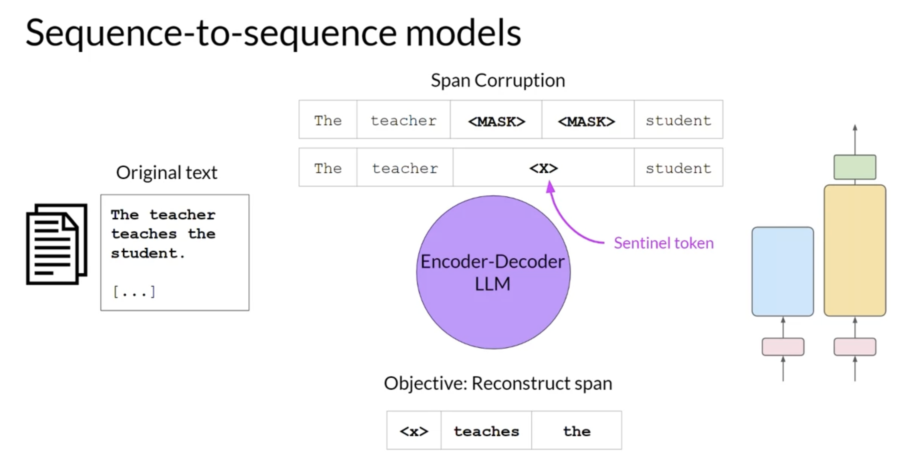
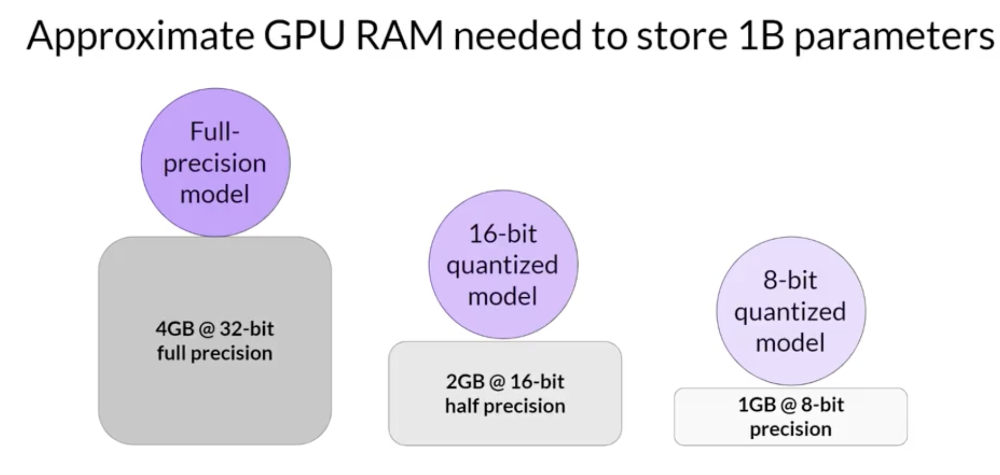

### Week 1

Generative AI Foundational Models: GPT, LLaMa, BERT, PaLM, BLOOM, FLAN-T5.

The more parameters, the more memory and language understanding and the more sophisticated tasks it can perform.

Prompt (Context Window) -> Inference -> Completion

**Next word prediction** can be used for summarization, translation, coding, information retrieval, named entity recognition...

You don't always need a large model, smaller models can be fine-tuned to specific focused tasks. 

Previous generation models used Recurrent Neural Networks (RNNs). RNNs while powerful for their time, were limited by the amount of compute and memory needed to perform well at generative tasks.

**Transformer architecture** started with paper "Attention is all you need", in 2017. This novel approach unlocked the progress in generative AI that we see today. It can be scaled efficiently to use multi-core GPUs, it can parallel process input data, making use of much larger training datasets, and crucially, it's able to learn to pay attention to the meaning of the words it's processing.

### Transformers

The power of the transformer architecture lies in its ability to learn the relevance and context of all of the words in a sentence. Not just to each word next to its neighbor, but to every other word in a sentence. To apply attention weights to those relationships so that the model learns the relevance of each word to each other words no matter where they are in the input. 

Words are tokenized before fed to the model since a Machine Learning model works with numbers and not words. A token can represent the whole word or a part of the word. You then have to use the same tokenizer to train and predict/generate. The token is then embedded, mapped to a multidimensional vector, that encodes the meaning and context of individual tokens in the input sequence. Positional embeddings are also added to preserve the ordering of words in the input sentence.

The embeddings are passed into the self-attention layers, which learn the importance of every word to every other word in the input sequence. It has **Multi-headed self-attention**. This means that multiple sets of self-attention weights or heads are learned in parallel independently of each other. The number of attention heads included in the attention layer varies from model to model, but numbers in the range of 12-100 are common. The intuition here is that each self-attention head will learn a different aspect of language. For example, one head may see the relationship between the people entities in our sentence. Whilst another head may focus on the activity of the sentence. Whilst yet another head may focus on some other properties such as if the words rhyme. We don't dictate ahead of time which aspect of language each head will learn, the weights of each head are randomly initialized.

The output is then processed through a fully-connected feed-forward network. The output of this layer is a vector of logits proportional to the probability score for each and every token in the tokenizer dictionary. You can then pass these logits to a final softmax layer, where they are normalized into a probability score for each word.
One single token will have a score higher than the rest. This is the most likely predicted token.

Example: translation

Encoder: encodes inputs ("prompts") with contextual understanding and produces one vector per input token.

Decoder: Accepts input tokens and generates new tokens.

There are encoder only models, encoder decoders models and decoder only models. Decoder only models are the most popular today.

**"Attention is All You Need"**

"Attention is All You Need" is a research paper published in 2017 by Google researchers, which introduced the Transformer model, a novel architecture that revolutionized the field of natural language processing (NLP) and became the basis for the LLMs we  now know - such as GPT, PaLM and others. The paper proposes a neural network architecture that replaces traditional recurrent neural networks (RNNs) and convolutional neural networks (CNNs) with an entirely attention-based mechanism. 

The Transformer model uses self-attention to compute representations of input sequences, which allows it to capture long-term dependencies and parallelize computation effectively. The authors demonstrate that their model achieves state-of-the-art performance on several machine translation tasks and outperforms previous models that rely on RNNs or CNNs.

The Transformer architecture consists of an encoder and a decoder, each of which is composed of several layers. Each layer consists of two sub-layers: a multi-head self-attention mechanism and a feed-forward neural network. The multi-head self-attention mechanism allows the model to attend to different parts of the input sequence, while the feed-forward network applies a point-wise fully connected layer to each position separately and identically. 

The Transformer model also uses residual connections and layer normalization to facilitate training and prevent overfitting. In addition, the authors introduce a positional encoding scheme that encodes the position of each token in the input sequence, enabling the model to capture the order of the sequence without the need for recurrent or convolutional operations.

**Prompt engineering**

- **In-context learning** - Include examples in the context window to help the model learn the task. Zero / one / few shot inference. If more than 5-6 examples don't increase performance, fine-tuning should be preferred. 

The larger the model, the more performant it is at zero shot inference. Smaller models are generally good at a few tasks, similar to the ones they were trained on.

Inference configuration parameters - temperature, max new tokens, topK, topP.

Greedy vs random sampling - greedy will always choose the word with the highest probability but words can be repeated and the answer gets less natural and less reasonable so this method is good for short generation. Random sampling will select based on random-weighted strategy across all probabilities so this generates more natural and creative text.

topK selects an output using the top-K results after applying random-weighted strategy using the probabilities. 

topP selects using the random-weighted strategy with the top-ranked consecutive results by probability and with a cumulative probability <= p.

Temperature influences the shape of the probability distribution. The higher the temperature, the higher the randomness. The temperature actually alters the predictions the model will make, unlike topK or topP.

LLM pre-training: learning from large amounts of unstructured textual data, learning patterns and structures in the language. Involves a lot of compute and GPUs. Often needed are data filtering, to improve quality, reduce bias and remove harmful content. Only 1-3% of the original tokens are kept for training!

Encoder only models are trained on masked language modeling tasks, where some randomly chosen tokens are masked and the model has to predict them. These models build bidirectional representations of the input sequence, understanding the full context of each token in the sequence. They are good for tasks that benefit from understanding the full context of the input (bidirectional context): sentiment analysis, named entity recognition, word classification. e.g. BERT, ROBERTA.

Decoder only models are trained on causal language modeling tasks, where the model has to predict the next token in the sequence. The context used is unidirectional, only previous tokens are seen by the model during training. These models are good for tasks like text generation. e.g. GPT, BLOOM.

The exact details of the pre-training objective of Encoder-decoder models vary from model to model. A popular sequence-to-sequence model T5, pre-trains based on span corruption tasks. These models are good for translation, summarization, question answering. e.g. BART, T5.

In general, the more parameters, the more capable a model is at any given task. It may be infeasible to just keep increasing and training larger and larger models, given the cost, though.

Computational challenges: CUDA runs out of memory. e.g. 24GB of GPU RAM to train a 1B parameter model @ 32-bit precision. This is to store the model weights, activations, gradients, optimizer states, etc.

To address this, 16-bit precision can be used (quantization), which lowers precision but is acceptable for most cases.

BFLOAT16 is another option, used for newer deep learning models, like flan-T5. It significantly helps with pre-training stability. It's known as truncated 32-bit float. Not well suited for integer calculations but these are relatively rare in deep learning calculations.

INT8 will incur a huge precision loss. 

Quantization aware training learns the quantization scaling factors during training.

As models scale, multiple GPUs for training are needed. 

Data parallelism is a strategy that splits the training data across multiple GPUs. Each GPU processes a different subset of the data simultaneously, which can greatly speed up the overall training time.

Distribute Data Parallel from pytorch - Distribute datasets across GPUs which train a copy of the model, and then synchronization step combines the results. Requires that the model fits in a single GPU.

Fully sharded data parallel - Zero redundancy optimizer distributes models across GPUs. This is suitable for models that cannot fit in a single GPU.

Researchers have explored the trade-offs between training dataset size, model size and compute budget. 

1 petaflop/s-day is approximately equivalent to 8 NVIDIA V100 chips operating at full efficiency for one day, in the context of training transformers. This is equivalent to 2 NVIDIA A100 GPUs. Huge amounts of compute are required to train the bigger models...

Chinchilla paper suggests that some large models may be over parametrized and under trained. So smaller models are starting to come up, trained more optimally.

Pre-training for domain adaptation - when very specific language are common but unlikely to have come up extensively in the training dataset. e.g. BloombergGPT

BloombergGPT, developed by Bloomberg, is a large Decoder-only language model. It underwent pre-training using an extensive financial dataset comprising news articles, reports, and market data, to increase its understanding of finance and enabling it to generate finance-related natural language text. The datasets are shown in the image above.

During the training of BloombergGPT, the authors used the Chinchilla Scaling Laws to guide the number of parameters in the model and the volume of training data, measured in tokens. The recommendations of Chinchilla are represented by the lines Chinchilla-1, Chinchilla-2 and Chinchilla-3 in the image, and we can see that BloombergGPT is close to it. 

While the recommended configuration for the team’s available training compute budget was 50 billion parameters and 1.4 trillion tokens, acquiring 1.4 trillion tokens of training data in the finance domain proved challenging. Consequently, they constructed a dataset containing just 700 billion tokens, less than the compute-optimal value. Furthermore, due to early stopping, the training process terminated after processing 569 billion tokens.

The BloombergGPT project is a good illustration of pre-training a model for increased domain-specificity, and the challenges that may force trade-offs against compute-optimal model and training configurations.

In contrast to pre-training, where you train the LLM using vast amounts of unstructured textual data via self-supervised learning, fine-tuning is a supervised learning process where you use a data set of labeled examples to update the weights of the LLM. The labeled examples are prompt completion pairs, the fine-tuning process extends the training of the model to improve its ability to generate good completions for a specific task.

**Instruction fine-tuning** trains the model using examples that demonstrate how it should respond to a specific instruction.

You can fine-tune a pre-trained model to improve performance on only the task that is of interest to you. For example, summarization using a dataset of examples for that task. Interestingly, good results can be achieved with relatively few examples. Often just 500-1,000 examples can result in good performance in contrast to the billions of pieces of texts that the model saw during pre-training. However, there is a potential downside to fine-tuning on a single task. The process may lead to a phenomenon called **catastrophic forgetting**. Catastrophic forgetting happens because the full fine-tuning process modifies the weights of the original LLM. While this leads to great performance on the single fine-tuning task, it can degrade performance on other tasks. If you do want or need the model to maintain its multitask generalized capabilities, you can perform fine-tuning on multiple tasks at one time. Good multitask fine-tuning may require 50-100,000 examples across many tasks, and so will require more data and compute to train. Our second option is to perform parameter efficient fine-tuning, or PEFT for short instead of full fine-tuning. PEFT is a set of techniques that preserves the weights of the original LLM and trains only a small number of task-specific adapter layers and parameters. PEFT shows greater robustness to catastrophic forgetting since most of the pre-trained weights are left unchanged.

One way to mitigate catastrophic forgetting is by using regularization techniques to limit the amount of change that can be made to the weights of the model during training. This can help to preserve the information learned during earlier training phases and prevent overfitting to the new data.

FLAN, which stands for fine-tuned language net, is a specific set of instructions used to fine-tune different models. FLAN-T5, the FLAN instruct version of the T5 foundation model. FLAN-T5 is a great general purpose instruct model. In total, it's been fine tuned on 473 datasets across 146 task categories. 

We can also further fine tine the FLAN-T5 model based on custom data, e.g. dialogue conversations which we would like it to summarize later.

### LLM Evaluation Metrics

Accuracy = Correct predictions / total predictions

Accuracy is not viable since LLMs are not deterministic in their outputs.

ROUGE-1 doesn't consider ordering of the words. Also, "it is very cold outside" and "it is not cold outside" would get the same score...

ROUGE-2 aknowledge the ordering of words by taking pairs of words at a time. 

ROUGE scores for different tasks are not comparable to one another. 

Use rouge for diagnostic evaluation of summarization tasks and BLEU for translation tasks. For overall evaluation of your model's performance, however, you will need to look at one of the evaluation benchmarks that have been developed by researchers.

You'll get a more accurate and useful sense of the model's capabilities by evaluating its performance on data that it hasn't seen before. Benchmarks, such as **GLUE**, **SuperGLUE**, or **Helm**, cover a wide range of tasks and scenarios. They do this by designing or collecting datasets that test specific aspects of an LLM. 

**GLUE**, or General Language Understanding Evaluation, was introduced in 2018. GLUE is a collection of natural language tasks, such as sentiment analysis and question-answering. GLUE was created to encourage the development of models that can generalize across multiple tasks, and you can use the benchmark to measure and compare the model performance. 

As a successor to GLUE, **SuperGLUE** was introduced in 2019, to address limitations in its predecessor. It consists of a series of tasks, some of which are not included in GLUE, and some of which are more challenging versions of the same tasks. SuperGLUE includes tasks such as multi-sentence reasoning, and reading comprehension. Both the GLUE and SuperGLUE benchmarks have leaderboards that can be used to compare and contrast evaluated models. As models get larger, their performance against benchmarks such as SuperGLUE start to match human ability on specific tasks.

Here are a couple of recent benchmarks that are pushing LLMs further. **Massive Multitask Language Understanding**, or MMLU, is designed specifically for modern LLMs. To perform well models must possess extensive world knowledge and problem-solving ability. Models are tested on elementary mathematics, US history, computer science, law, and more. In other words, tasks that extend way beyond basic language understanding.

**BIG-bench** currently consists of 204 tasks, ranging through linguistics, childhood development, math, common sense reasoning, biology, physics, social bias, software development and more. BIG-bench comes in three different sizes, and part of the reason for this is to keep costs achievable, as running these large benchmarks can incur large inference costs. 

A final benchmark you should know about is the **Holistic Evaluation of Language Models**, or HELM. The HELM framework aims to improve the transparency of models, and to offer guidance on which models perform well for specific tasks. HELM takes a multimetric approach, measuring seven metrics across 16 core scenarios, ensuring that trade-offs between models and metrics are clearly exposed.

### Parameter-efficient fine-tuning (PEFT)

**Full fine-tuning** requires memory not just to store the model, but various other parameters that are required during the training process. Even if your computer can hold the model weights, which are now on the order of hundreds of gigabytes for the largest models, you must also be able to allocate memory for optimizer states, gradients, forward activations, and temporary memory throughout the training process. These additional components can be many times larger than the model and can quickly become too large to handle on consumer hardware.

In contrast to full fine-tuning where every model weight is updated during supervised learning, parameter efficient fine tuning methods only update a small subset of parameters. 

Some PEFT techniques freeze most of the model weights and focus on fine tuning a subset of existing model parameters, for example, particular layers or components. Other techniques don't touch the original model weights at all, and instead add a small number of new parameters or layers and fine-tune only the new components.

With PEFT, most if not all of the LLM weights are kept frozen. As a result, the number of trained parameters is much smaller than the number of parameters in the original LLM. In some cases, just 15-20% of the original LLM weights.

In fact, PEFT can often be performed on a single GPU. And because the original LLM is only slightly modified or left unchanged, PEFT is less prone to the catastrophic forgetting problems of full fine-tuning.

With parameter efficient fine-tuning, you train only a small number of weights, which results in a much smaller footprint overall, as small as megabytes depending on the task. The new parameters are combined with the original LLM weights for inference. The PEFT weights are trained for each task and can be easily swapped out for inference, allowing efficient adaptation of the original model to multiple tasks.

There are several methods you can use for parameter efficient fine-tuning, each with trade-offs on parameter efficiency, memory efficiency, training speed, model quality, and inference costs. Let's take a look at the three main classes of PEFT methods. 

**Selective methods** are those that fine-tune only a subset of the original LLM parameters. There are several approaches that you can take to identify which parameters you want to update. You have the option to train only certain components of the model or specific layers, or even individual parameter types. Researchers have found that the performance of these methods is mixed and there are significant trade-offs between parameter efficiency and compute efficiency. 

**Reparameterization methods** also work with the original LLM parameters, but reduce the number of parameters to train by creating new low rank transformations of the original network weights. A commonly used technique of this type is **LoRA**.

Lastly, **additive methods** carry out fine-tuning by keeping all of the original LLM weights frozen and introducing new trainable components. Here there are two main approaches. Adapter methods add new trainable layers to the architecture of the model, typically inside the encoder or decoder components after the attention or feed-forward layers. Soft prompt methods, on the other hand, keep the model architecture fixed and frozen, and focus on manipulating the input to achieve better performance. This can be done by adding trainable parameters to the prompt embeddings or keeping the input fixed and retraining the embedding weights.

Low-rank Adaptation, or LoRA for short, is a parameter-efficient fine-tuning technique that falls into the re-parameterization category. In the transformer architecture, the input prompt is turned into tokens, which are then converted to embedding vectors and passed into the encoder and/or decoder parts of the transformer. In both of these components, there are two kinds of neural networks; self-attention and feedforward networks. The weights of these networks are learned during pre-training. After the embedding vectors are created, they're fed into the self-attention layers where a series of weights are applied to calculate the attention scores. During full fine-tuning, every parameter in these layers is updated. 

LoRA is a strategy that reduces the number of parameters to be trained during fine-tuning by freezing all of the original model parameters and then injecting a pair of rank decomposition matrices alongside the original weights. The dimensions of the smaller matrices are set so that their product is a matrix with the same dimensions as the weights they're modifying. You then keep the original weights of the LLM frozen and train the smaller matrices using the same supervised learning process you saw earlier this week. For inference, the two low-rank matrices are multiplied together to create a matrix with the same dimensions as the frozen weights. You then add this to the original weights and replace them in the model with these updated values. 

Because this model has the same number of parameters as the original, there is little to no impact on inference latency.

Researchers have found that applying LoRA to just the self-attention layers of the model is often enough to fine-tune for a task and achieve performance gains. However, in principle, you can also use LoRA on other components like the feed-forward layers.

Let's look at a practical example using the transformer architecture described in the Attention is All You Need paper. The paper specifies that the transformer weights have dimensions of 512 by 64. This means that each weights matrix has 32,768 trainable parameters. If you use LoRA as a fine-tuning method with the rank equal to eight, you will instead train two small rank decomposition matrices whose small dimension is eight. This means that Matrix A will have dimensions of 8 by 64, resulting in 512 total parameters. Matrix B will have dimensions of 512 by 8, or 4,096 trainable parameters. By updating the weights of these new low-rank matrices instead of the original weights, you'll be training 4,608 parameters instead of 32,768 and 86% reduction.

Because LoRA allows you to significantly reduce the number of trainable parameters, you can often perform this method of parameter efficient fine tuning with a single GPU and avoid the need for a distributed cluster of GPUs.

Since the rank-decomposition matrices are small, you can fine-tune a different set for each task and then switch them out at inference time by updating the weights. Suppose you train a pair of LoRA matrices for a specific task; let's call it Task A. To carry out inference on this task, you would multiply these matrices together and then add the resulting matrix to the original frozen weights. You then take this new summed weights matrix and replace the original weights where they appear in your model. You can then use this model to carry out inference on Task A. If instead, you want to carry out a different task, say Task B, you simply take the LoRA matrices you trained for this task, calculate their product, and then add this matrix to the original weights and update the model again. The memory required to store these LoRA matrices is very small. So in principle, you can use LoRA to train for many tasks. Switch out the weights when you need to use them, and avoid having to store multiple full-size versions of the LLM.

The takeaway here is that ranks in the range of 4-32 can provide you with a good trade-off between reducing trainable parameters and preserving performance. Optimizing the choice of rank is an ongoing area of research and best practices may evolve as more practitioners like you make use of LoRA.

### Prompt tuning

With prompt tuning, you add additional trainable tokens to your prompt and leave it up to the supervised learning process to determine their optimal values. The set of trainable tokens is called a **soft prompt**, and it gets prepended to embedding vectors that represent your input text. The soft prompt vectors have the same length as the embedding vectors of the language tokens. And including somewhere between 20 and 100 virtual tokens can be sufficient for good performance. 

The tokens that represent natural language are hard in the sense that they each correspond to a fixed location in the embedding vector space. However, the soft prompts are not fixed discrete words of natural language. Instead, you can think of them as virtual tokens that can take on any value within the continuous multidimensional embedding space. And through supervised learning, the model learns the values for these virtual tokens that maximize performance for a given task. 

The weights of the large language model are frozen and the underlying model does not get updated. Instead, the embedding vectors of the soft prompt gets updated over time to optimize the model's completion of the prompt.

Similar to what you saw with LoRA, you can train a different set of soft prompts for each task and then easily swap them out at inference time. You can train a set of soft prompts for one task and a different set for another. To use them for inference, you prepend your input prompt with the learned tokens to switch to another task, you simply change the soft prompt. Soft prompts are very small on disk, so this kind of fine tuning is extremely efficient and flexible.

Prompt tuning doesn't perform as well as full fine tuning for smaller LLMs. However, as the model size increases, so does the performance of prompt tuning. And once models have around 10 billion parameters, prompt tuning can be as effective as full fine tuning and offers a significant boost in performance over prompt engineering alone

One potential issue to consider is the interpretability of learned virtual tokens. Remember, because the soft prompt tokens can take any value within the continuous embedding vector space. The trained tokens don't correspond to any known token, word, or phrase in the vocabulary of the LLM. However, an analysis of the nearest neighbor tokens to the soft prompt location shows that they form tight semantic clusters.
